# TP1 — Monitor de Procesos (tipo htop)

Monitor de procesos del sistema en tiempo real, construido en Python con
`multiprocessing` y una TUI en `curses`. Lee `/proc` directamente y presenta la
información en 7 vistas navegables por teclado. Corre dentro de un contenedor
Docker con acceso a los procesos del host.

**Computación II — 2026 — Tomás Valentín Villar**

---

## 1. Descripción general

El monitor recolecta información de todos los procesos del sistema leyendo el
sistema de archivos virtual `/proc`, y la muestra en una interfaz de terminal
interactiva. La arquitectura es multiproceso: **7 analizadores independientes**
(uno por cada tipo de dato) corren en paralelo, cada uno publicando sus
resultados en memoria compartida, mientras un **proceso de display** los lee y
dibuja la TUI.

Las 7 vistas son:

| Tecla | Vista | Qué muestra |
|-------|-------|-------------|
| `1` / `r` | Resumen | PID, usuario, CPU%, threads, estado, comando completo |
| `2` / `m` | Memoria | VmRSS, VmSize, VmData/Stk/Exe/Lib, segmentos (text/data/heap/stack/shared), page faults |
| `3` / `f` | File descriptors | Cantidad y tipo de FDs abiertos por proceso |
| `4` / `t` | Threads | Threads (LWPs) por proceso, CPU% por thread |
| `5` / `s` | Señales | Máscaras de señales (bloqueadas, ignoradas, capturadas, pendientes) |
| `6` / `p` | Scheduling | Prioridad, nice, política, context switches, affinity |
| `7` / `g` | Sistema | Vista global: uptime, RAM, load, CPU global, top procesos |

### Cómo se usa

Navegación por teclado (ver la ayuda completa con `h`):

- **Flechas** ↑↓ — mover la selección.
- **Enter** — fijar (pin) un proceso y ver su detalle completo en un panel inferior.
- **`/`** — filtrar por nombre de proceso.
- **`u`** — filtrar por usuario (UID).
- **`c`** — cambiar el criterio de orden (CPU% / RSS / PID).
- **`+` / `-`** — ajustar el intervalo de refresco de la vista activa.
- **`h` / `?`** — mostrar la pantalla de ayuda.
- **`q`** — salir.

---

## 2. Arquitectura

```
                          +---------------------+
                          |   main.py (padre)   |
                          |  - crea el Manager  |
                          |  - lanza procesos   |
                          |  - maneja señales   |
                          +----------+----------+
                                     |
             +-----------------------+------------------------+
             |            crea y comparte (IPC)               |
             v                                                v
   +-------------------+                            +-------------------+
   |  Manager dict     |  <---- publican ----+      |  dict de Value    |
   |  shared["resumen"]|                     |      |  (intervalos)     |
   |  shared["memoria"]|                     |      |  Value('i', N)    |
   |  shared["senales"]|                     |      +---------+---------+
   |  ...  (7 claves)  |                     |                |
   |  shared["seguir"] |                     |                | leen su intervalo
   |  shared["verbose"]|                     |                v
   +---------+---------+          +----------+----------------------------+
             |                    | 7 analizadores (procesos hijos)       |
             | lee               |  resumen, memoria, senales, fds,      |
             v                   |  threads, scheduling, sistema         |
   +-------------------+         |  - cada uno lee /proc                 |
   |  display (proceso) |        |  - publica en su clave del shared     |
   |  - TUI con curses  |        |  - duerme intervalo.value segundos    |
   |  - lee shared      |        +---------------------------------------+
   |  - dibuja 7 vistas |
   +-------------------+
```

**Flujo de datos:** cada analizador lee `/proc`, calcula su información y la
publica en su clave del `Manager` dict. El display lee esas claves y las dibuja.
Los analizadores **solo escriben**; el display **solo lee**. Se comunican
exclusivamente a través de la memoria compartida (nunca directamente).

**Comunicación entre procesos (IPC) usada:**
- **Manager dict** — para los datos de las vistas (estructuras complejas).
- **`multiprocessing.Value`** — para los intervalos de refresco (números simples).
- **Señales** — SIGINT/SIGTERM (cierre), SIGUSR1/SIGUSR2/SIGHUP (control).

---

## 3. Decisiones de diseño

### ¿Por qué multiprocessing y no threading?

Los analizadores hacen trabajo de CPU (parsear `/proc`). El **GIL** (Global
Interpreter Lock) de Python impide que varios threads ejecuten bytecode Python
en paralelo. Con procesos separados, cada uno tiene su propio intérprete y su
propio GIL, logrando **paralelismo real** sobre los múltiples núcleos.

### ¿Por qué Manager y no Value/Array para los datos?

Los datos de cada vista son **estructuras complejas** (diccionarios de
diccionarios: `{pid: {campo: valor, ...}}`). `Value` y `Array` sirven solo para
tipos simples (un número, un arreglo de números), no para estructuras anidadas.
El `Manager` sí soporta diccionarios y objetos complejos, a costa de ser más
lento (levanta un proceso servidor y cada acceso viaja por IPC).

En cambio, para los **intervalos de refresco** (un número entero por vista) sí
uso `Value`, porque es memoria compartida directa, mucho más liviana que el
Manager. **Herramienta adecuada a cada caso:** Manager para lo complejo, Value
para lo simple.

### ¿Cómo manejo las race conditions?

**Publicación atómica.** Cada analizador arma su resultado en un diccionario
**local** y lo publica al Manager con **una sola asignación**
(`shared["resumen"] = resultado`). Esto evita que el display lea un estado a
medio actualizar: o ve el resultado viejo completo, o el nuevo completo, nunca
uno a medias. Además reduce la cantidad de accesos al Manager (que son costosos).

El historial de jiffies anteriores (para calcular CPU%) es **privado** de cada
analizador (variable interna, no va al shared): los otros procesos no lo
necesitan, así que no se comparte.

### ¿Por qué los intervalos elegidos por defecto?

Cada intervalo se ajusta a **cuán rápido cambia el dato**:
- **Resumen y threads: 2s** — el CPU% cambia constantemente, se quiere ver casi
  en tiempo real.
- **Memoria: 3s** — el uso de RAM cambia, pero más lento que el CPU.
- **FDs: 5s** — los descriptores abiertos cambian poco.
- **Señales y scheduling: 10s** — las máscaras de señales y la config de
  scheduling son casi estáticas (un proceso las fija al arrancar y rara vez las
  cambia).

Refrescar datos casi estáticos tan seguido como el CPU sería desperdiciar CPU
releyendo lo mismo. Los intervalos son ajustables en vivo (`+`/`-`) y
configurables por archivo (`config.json` + SIGHUP).

### Shutdown limpio (graceful)

El cierre **no** usa `terminate()` (SIGTERM interrumpe al hijo en cualquier
punto y se enreda con el Manager). En su lugar, uso una **bandera compartida**:
`shared["seguir"]`. Los hijos hacen `while shared["seguir"]` y la revisan cada
vuelta; el padre la baja y hace `join()`. El hijo termina su vuelta actual y
sale en un punto seguro. Los hijos **ignoran SIGINT** (`SIG_IGN`) para no morir
sueltos y quedar bajo control del padre.

### Manejo de señales: patrón flag

Los handlers de señales solo **levantan una bandera** (operación
async-signal-safe); el trabajo real lo hace el loop principal en un punto
seguro. Esto evita corromper estado si la señal interrumpe una operación
compleja a la mitad. Es el patrón recomendado en clase 6.

---

## 4. Conceptos del curso aplicados

- **File descriptors y pipes (clase 5):** la vista de FDs se apoya directamente
  en la clase 5. Cada proceso nace con los FDs 0/1/2 (stdin/stdout/stderr) y el
  kernel le da un número por cada recurso abierto. En `/proc/<pid>/fd/` cada FD
  es un symlink; leo su destino con `os.readlink()` y clasifico el tipo (socket,
  pipe, tty, file) por el prefijo del destino. Los pipes, vistos en esa clase,
  aparecen como uno de los tipos de FD.

- **Señales (clase 6):** SIGINT/SIGTERM para el cierre ordenado y
  SIGUSR1/SIGUSR2/SIGHUP para control. Los handlers usan el **patrón flag**
  (async-signal-safe): solo levantan una bandera, el trabajo real ocurre en el
  loop principal. La vista de Señales muestra las **máscaras de bits**
  (`SigBlk`/`SigIgn`/`SigCgt`/`SigPnd`) que se vieron en clase; decodifico cada
  bit para saber qué señal representa. Como se vio, **SIGKILL y SIGSTOP no se
  pueden capturar ni bloquear**, lo que se refleja en que ningún proceso los
  tiene en sus máscaras de capturadas/bloqueadas.

- **Memoria compartida — `Value` y race conditions (clase 7):** los intervalos
  de refresco usan `multiprocessing.Value`, presentado en la clase 7 junto a
  mmap como forma de compartir un valor simple entre procesos. La clase también
  mostró las **race conditions** al compartir memoria; las evito con
  **publicación atómica** (armar el resultado local y publicarlo con una sola
  asignación al Manager).

- **Fork y multiprocessing (clase 8):** los procesos se crean con `Process`
  (clase 8). Como cada proceso hijo tiene su **propia memoria** (herencia del
  fork), se necesita IPC para compartir datos: de ahí el `Manager` dict. El
  historial de jiffies privado de cada analizador ilustra que la memoria no se
  comparte salvo que se lo pida explícitamente. Uso el patrón de lista de
  procesos con `start()`/`join()` visto en esta clase.

- **GIL y Manager (clase 9):** la elección de `multiprocessing` sobre
  `threading` se basa en que el **GIL** (clase 9) serializa la ejecución de
  bytecode Python; con procesos separados, cada uno tiene su intérprete y su GIL,
  logrando paralelismo real. El `Manager` (clase 8-9) es lo que permite compartir
  estructuras complejas (los diccionarios de cada vista) entre procesos.

- **Threads / LWPs (clase 10):** la vista de Threads recorre
  `/proc/<pid>/task/<tid>/`, donde vive cada thread (LWP) del proceso. El thread
  principal tiene TID == PID; en Linux el PID es también el TGID. Muestro
  context switches voluntary (el thread cede la CPU, típico de I/O-bound) vs
  nonvoluntary (el kernel se la arranca, típico de CPU-bound).

- **Docker (clases 1 y 2):** todo el monitor corre en un contenedor. Uso
  `pid: host` para ver los procesos del host y `privileged` para leer los FDs de
  procesos ajenos (varias capas de aislamiento a la vez). El Dockerfile y el
  docker-compose se apoyan en lo visto en las clases 1 y 2.

- **Anatomía del proceso y estados (clase 3):** la vista de Resumen usa el
  campo estado (`R`/`S`/`D`/`T`/`Z`) que se vio en la clase 3, junto con la
  jerarquía de procesos (PPID) y las credenciales (UID). La clase 3 también
  introdujo la memoria virtual aislada y `/proc/<pid>/maps`, que uso en la vista
  de Memoria para clasificar los segmentos (text/data/heap/stack).

- **Zombies — fork, exec, wait (clases 3 y 4):** en la vista Sistema detecto
  zombies por el estado `Z` de `/proc/<pid>/stat`. Como se vio en la clase 4, un
  zombie es un proceso terminado cuyo padre todavía no llamó a `wait()` para
  recoger su estado de salida (la clase 3 ya lo había anticipado al hablar de la
  jerarquía de procesos).

- **Memoria virtual (clase 3, vista Memoria):** VmSize (espacio virtual
  reservado, puede ser mucho mayor que la RAM física) vs VmRSS (RAM realmente
  usada); page faults minor (página ya en RAM) vs major (hay que ir a disco).
  El aislamiento del espacio de direcciones virtuales es el que se explicó en
  la clase 3.

- **Scheduling (vista Scheduling):** muestro nice, prioridad, políticas
  (OTHER/FIFO/RR/IDLE), context switches (voluntary vs nonvoluntary), PGID, SID
  y affinity. El scheduling no tuvo una clase dedicada; esta vista extiende lo
  visto sobre procesos leyendo los campos de scheduling de `/proc/<pid>/stat` y
  `/proc/<pid>/status`.

---

## 5. Limitaciones conocidas

- **Filtro por usuario en FDs y Threads:** el filtro por usuario (`u`) funciona
  en las vistas que guardan el UID en su ficha (resumen, memoria, señales,
  scheduling). Las vistas de FDs y threads no parsean el `status`, así que no
  incluyen UID, y el filtro por usuario devuelve lista vacía ahí (no crashea,
  gracias a una guarda con short-circuit). Decisión de diseño: no forzar el
  parseo de status en esas dos vistas solo para el filtro.

- **Docker `up` vs `run` con curses:** `docker compose up --build` levanta todo
  (cumple el requisito), pero multiplexea la salida de los servicios, lo que
  interfiere con el renderizado de curses. Para la mejor experiencia interactiva
  se recomienda `docker compose run --rm monitor`, que asigna una terminal
  interactiva limpia. Es una fricción conocida entre curses y compose, no un bug
  del monitor.

- **Retardo en cambios de intervalo:** al ajustar un intervalo (`+`/`-` o
  SIGHUP), el cambio toma efecto en la próxima vuelta del analizador, porque el
  `sleep` en curso usa el valor que leyó al empezar. Es aceptable para un monitor.

- **Procesos de kernel (kthreads) sin FDs:** en la vista de FDs, los procesos de
  kernel (kthreadd, kworkers, etc.) muestran 0 descriptores. No es un error: los
  kthreads no tienen file descriptors de usuario, su `/proc/<pid>/fd/` está
  vacío. Los procesos normales sí muestran sus FDs correctamente.

- **Resolución de usuario (UID → nombre):** se resuelve con `pwd.getpwuid()`
  contra la base de usuarios **del contenedor**, no del host. Con `pid: host`
  se ven procesos de UIDs del host que pueden no existir en `/etc/passwd` del
  contenedor (o significar otro usuario); en ese caso se muestra el UID crudo
  como fallback en vez de un nombre.

- **Analizadores sin supervisor:** si un analizador muere (ej. `kill -9` a su
  PID), el monitor no lo reinicia. El proceso padre no lo detecta porque solo
  controla el flag `shared["seguir"]`, no la salud de cada hijo. El resto del
  monitor sigue funcionando con normalidad, pero la vista de ese analizador
  queda congelada con el último dato publicado (no crashea ni se vacía).

---

## 6. Cómo correr y testear

### Requisitos
- Docker y Docker Compose.

### Correr

Comando único (según la consigna):
```bash
docker compose up --build
```

Para la mejor experiencia interactiva de la TUI (recomendado):
```bash
docker compose run --rm monitor
```

Ambos construyen la imagen y levantan el monitor con acceso completo a `/proc`
del host (`pid: host`, `privileged: true`).

Si se hicieron cambios en el código y Docker usa una imagen cacheada vieja,
forzar la reconstrucción:
```bash
docker compose build --no-cache
```

### Probar las señales de control

Las señales se envían **desde dentro del contenedor** (el Dockerfile instala
`procps` para tener `pkill` disponible). Con el monitor corriendo, en otra
terminal:

```bash
docker compose exec monitor sh
# ya dentro del contenedor:
pkill -USR1 -f main.py    # dump del estado a dump_<timestamp>.json (en /app/src/)
pkill -USR2 -f main.py    # toggle del modo verbose (más detalle en cada vista)
pkill -HUP  -f main.py    # recargar config.json (intervalos)
```

Se envían desde dentro del contenedor porque los procesos corren como root del
contenedor, y un usuario normal del host no tiene permiso para señalarlos
directamente (salvo con `sudo`).

Para probar SIGHUP: editar `config.json`, cambiar un intervalo, y mandar la
señal — el cambio se aplica en vivo sin reiniciar. El dump SIGUSR1 genera un
`dump_<timestamp>.json` con una foto de las 7 vistas.

Corriendo el monitor **fuera** de Docker (con Python directo), las señales se
mandan igual pero sin el `docker compose exec`:
```bash
pkill -USR2 -f main.py
```

### Por qué privileged y pid: host

- **`pid: host`** — para ver los procesos del host (comparte el namespace de PIDs).
- **`privileged: true`** — para leer los FDs de procesos ajenos. El acceso a los
  symlinks de `/proc/<pid>/fd/` de otros procesos está protegido por varias capas
  a la vez (capabilities + seccomp + LSM); `privileged` las desactiva juntas. Se
  resigna el aislamiento del contenedor, aceptable para un monitor tipo htop que
  por naturaleza necesita ver todo el sistema.

---

## 7. Capturas de pantalla

## 8. Capturas de pantalla

### Vista de resumen
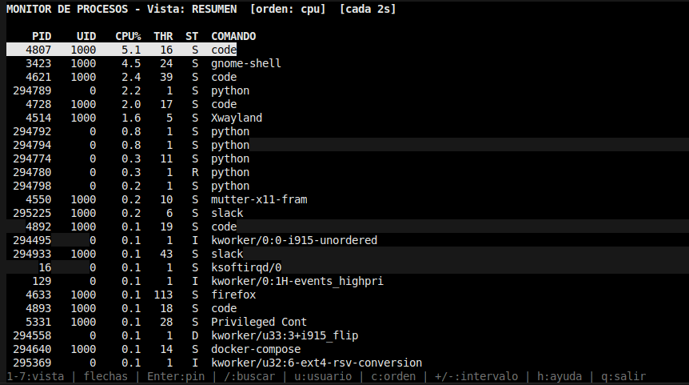

### Panel de detalle (proceso pineado)
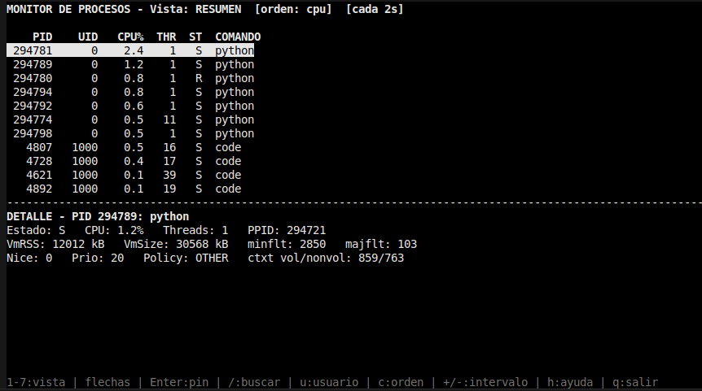

### Vista de resumen (modo verbose)
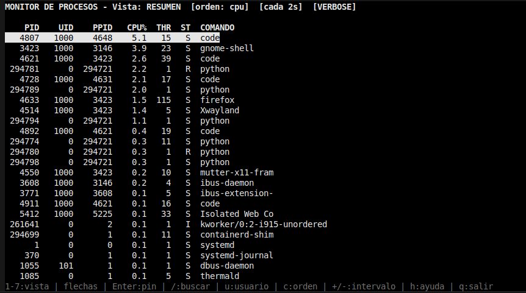

### Vista de resumen (filtro de comando code)
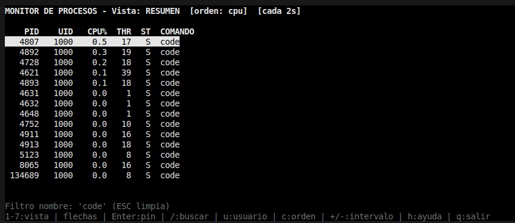

### Vista de resumen (filtro de UID 0)
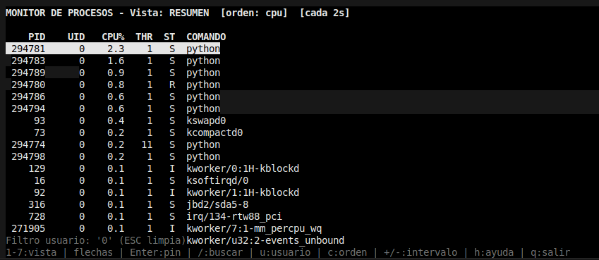

### Vista de memoria
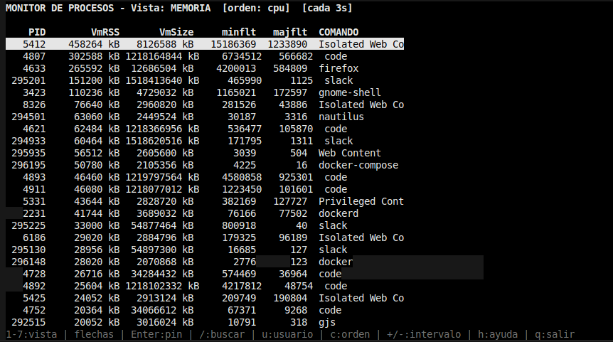

### Vista de señales
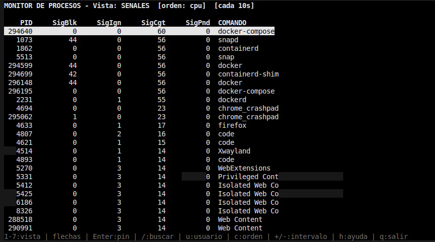

### Vista de FDs
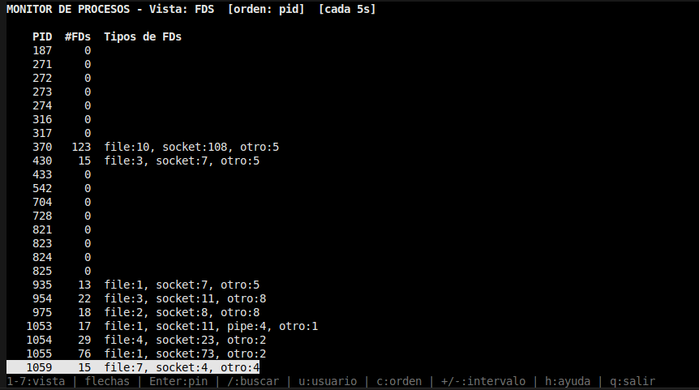

### Vista de threads
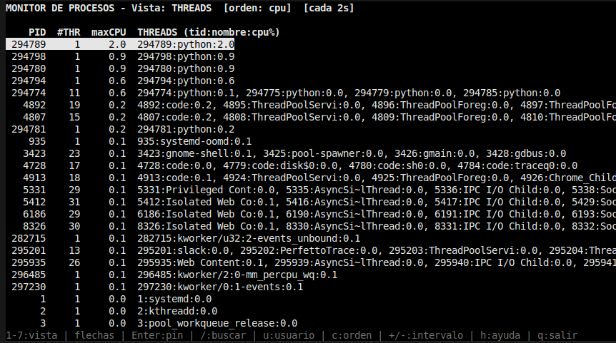

### Vista de scheduling
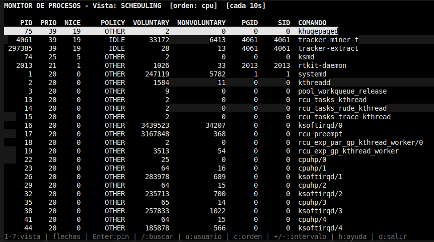

### Vista de sistema
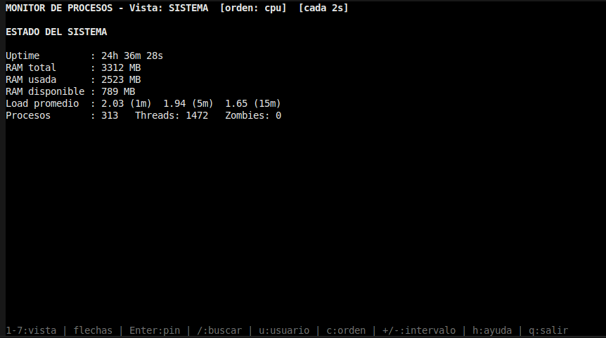

### Vista de sistema (modo verbose)
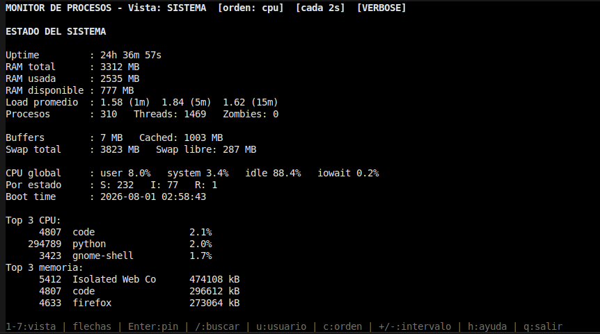

---

## 8. Decisiones sobre la TUI

Elegí **curses** sobre rich por dos razones: (1) la navegación por teclado que
pide la consigna (cambio de vista, scroll, filtros, ajuste de intervalos)
necesita control fino del teclado, que curses maneja tecla por tecla; (2) curses
viene con Python (una dependencia menos) y es lo que usa htop por debajo, así
que encaja con la filosofía "cerca del sistema" del TP.

El layout es lista arriba + panel de detalle abajo (cuando hay un proceso
pineado). El refresco usa `timeout(200)` para actualizar la pantalla sin quemar
CPU (evita busy-wait) y seguir respondiendo al teclado. `curses.wrapper()`
garantiza restaurar la terminal al salir, incluso si hay un error.## 8. Capturas de pantalla

---

## 9. Lo que aprendí

En este proyecto lo que más aprendí, sobre todo, fue a trabajar junto con la IA de forma más activa, donde yo tengo que ir deduciendo cómo resolver cada paso para completar el TP siendo guiado por la IA, en lugar de decirle qué tiene que hacer sin que yo sepa lo que está haciendo. Me pareció una forma muy buena de aprender a medida que fui haciendo el TP.

Ahora, respecto al TP, aprendí cómo hacer que el contenedor pueda ver la información sensible de los procesos a través del docker compose. Aprendí a calcular el % de CPU utilizando dos lecturas para calcular la diferencia. También entendí cómo funciona la comunicación entre los procesos a través del Manager, Value y las señales. Entendí cómo hacen ciertos comandos de la terminal como htop para ver la información de los procesos, y también el funcionamiento de la interacción del teclado con la TUI, es decir, cómo dependiendo de las teclas se altera una variable para que ocurran distintas acciones.

---

## Estructura del proyecto

```
tp1/
├── config.json            # intervalos por defecto
├── Dockerfile
├── docker-compose.yml
├── README.md
├── notas.md               # notas de diseño (borrador de este README)
└── src/
    ├── main.py            # orquestador (padre): Manager, procesos, señales
    ├── procfs.py          # helpers de parseo de /proc compartidos
    ├── display.py         # TUI con curses
    └── analizadores/
        ├── resumen.py
        ├── memoria.py
        ├── senales.py
        ├── fds.py
        ├── threads.py
        ├── scheduling.py
        └── sistema.py
```